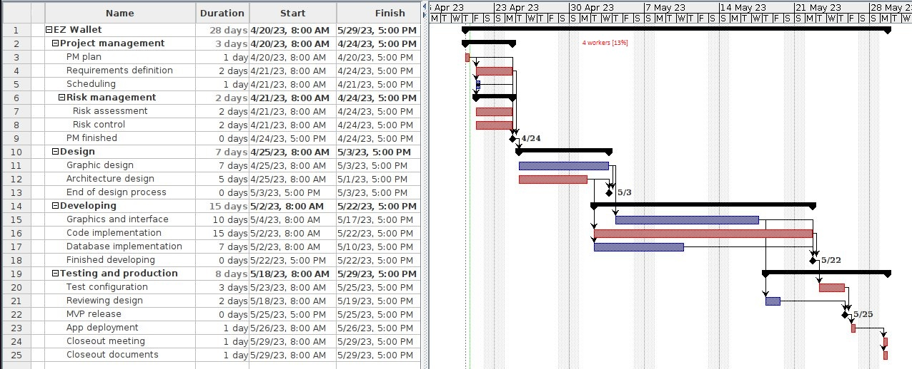

# Project Estimation - CURRENT
Date:

Version: V1 - description of EZWallet in CURRENT form (as received by teachers)

# Estimation approach
Consider the EZWallet  project in CURRENT version (as received by the teachers), assume that you are going to develop the project INDEPENDENT of the deadlines of the course
# Estimate by size
### 
|             | Estimate                        |
| ----------- | ------------------------------- |
| NC =  Estimated number of classes to be developed   | 12 |
|  A = Estimated average size per class, in LOC       | 76 |
| S = Estimated size of project, in LOC (= NC * A) | 912 |
| E = Estimated effort, in person hours (here use productivity 10 LOC per person hour)  | ca. 92 |
| C = Estimated cost, in euro (here use 1 person hour cost = 30 euro) | 2760 |
| Estimated calendar time, in calendar weeks (Assume team of 4 people, 8 hours per day, 5 days per week ) | 0.575 |

# Estimate by product decomposition
### 
|         component name    | Estimated effort (person hours)   |
| ----------- | ------------------------------- |
|requirement document    | 17 |
| GUI prototype |23|
|design document |10|
|code |40|
| unit tests |2|
| api tests |2|
| management documents  |1|

# Estimate by activity decomposition
###

|         Activity name    | Estimated effort (person hours)   |
| ----------- | ------------------------------- |
| PM plan | 4 |
| Requirement definition | 2 |
|Scheduling|1|
|Risk assessment|1|
|Risk control|1|
|Graphic design|7|
|Architecture design|5|
|Graphics and interface|20|
|Code implementation|25|
|Database implementation|7|
|Test configuration|12|
|Reviewing design|2|
|App deployment|4|
|Closeout meeting|4|
|Closeout documents|4|

# Summary

Report here the results of the three estimation approaches. The  estimates may differ. Discuss here the possible reasons for the difference

|             | Estimated effort                        |   Estimated duration |
| ----------- | ------------------------------- | ---------------|
| estimate by size |92 person hours|0.6 weeks|
| estimate by product decomposition |95 person hours|0.6 weeks|
| estimate by activity decomposition |99 person hours|5.6 weeks|

The estimation by size is a very simple estimation. It is the easiest but it doesn't take count the difficulty of the problem or the repartition of time between different tasks (i.e. a company could choose to dedicate more time and energy to design).

The estimation by activity decomposition is the most accurate because with the Gantt chart we can represent things such as tasks being done faster due to all 4 workers being free, tasks that need to be predecessors to other tasks and in the end we can also represent the effort put by each worker.
