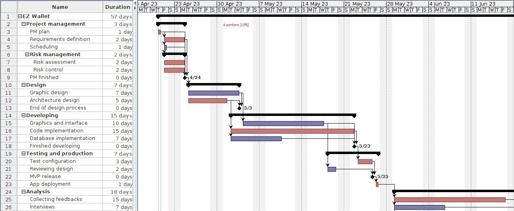
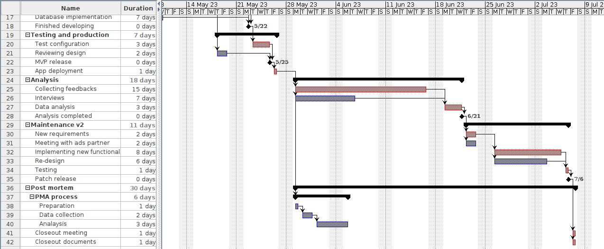

# Project Estimation - FUTURE
Date:

Version: V2 - description of EZWallet in FUTURE form (as proposed by the team)

# Estimation approach
Consider the EZWallet  project in FUTURE version (as proposed by the team), assume that you are going to develop the project INDEPENDENT of the deadlines of the course
# Estimate by size
### 
|             | Estimate                        |
| ----------- | ------------------------------- |
| NC =  Estimated number of classes to be developed   | 18 |
|  A = Estimated average size per class, in LOC       | 80 |
| S = Estimated size of project, in LOC (= NC * A) | 1440 |
| E = Estimated effort, in person hours (here use productivity 10 LOC per person hour)  | 144 |
| C = Estimated cost, in euro (here use 1 person hour cost = 30 euro) | 4320 |
| Estimated calendar time, in calendar weeks (Assume team of 4 people, 8 hours per day, 5 days per week ) | 0.9 |

# Estimate by product decomposition
### 
|         component name    | Estimated effort (person hours)   |
| ----------- | ------------------------------- |
|requirement document    | 23 |
| GUI prototype |27|
|design document |12|
|code |65|
| unit tests |3|
| api tests |3|
| management documents  |1|

# Estimate by activity decomposition
### 
|         Activity name    | Estimated effort (person hours)   |
| ----------- | ------------------------------- |
| PM plan | 4 |
|Requirements definition|2|
|Scheduling|1|
|Risk assessment|1|
|Risk control|1|
|Graphic design|7|
|Architecture design|5|
|Graphics and interface|20|
|Code implementation|25|
|Database implementation|7|
|Test configuration|12|
|Reviewing design|2|
|App deployment|4|
|Collecting feedbacks|1|
|Interviews|8|
|Data analysis|10|
|New requirements|2|
|Meeting with ads partner|3|
|Implementing new  functionalities|10|
|Re-design|4|
|Testing new functionalities|7|
|PMA process|5|
|Closeout meeting|4|
|Closeout documents|4|

# Summary

Report here the results of the three estimation approaches. The  estimates may differ. Discuss here the possible reasons for the difference

|             | Estimated effort                        |   Estimated duration |
| ----------- | ------------------------------- | ---------------|
| estimate by size |144|0.9 weeks|
| estimate by product decomposition |134|0.83 weeks|
| estimate by activity decomposition |149|3 weeks|

The estimated duration for the estimate by activity is quite different due to the addition of activities such as feedback collection that need a certain time of period to be collected even if it requires just a few person hours.
It's also a lot higher since the 4 workers may be working on different tasks as well; 13% of their work time has been considered for the estimate by activity
