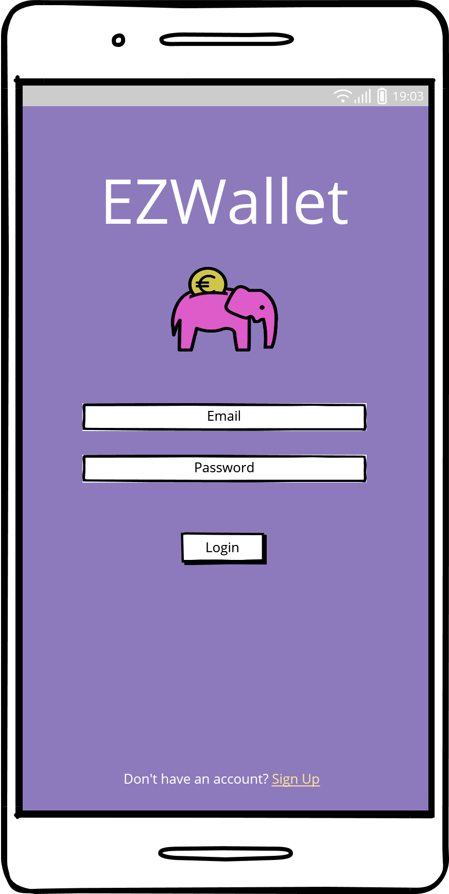
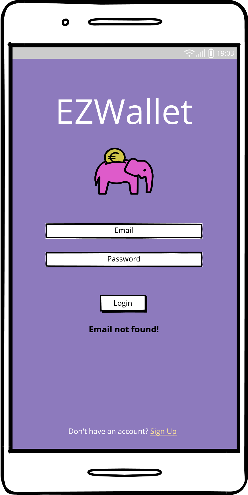
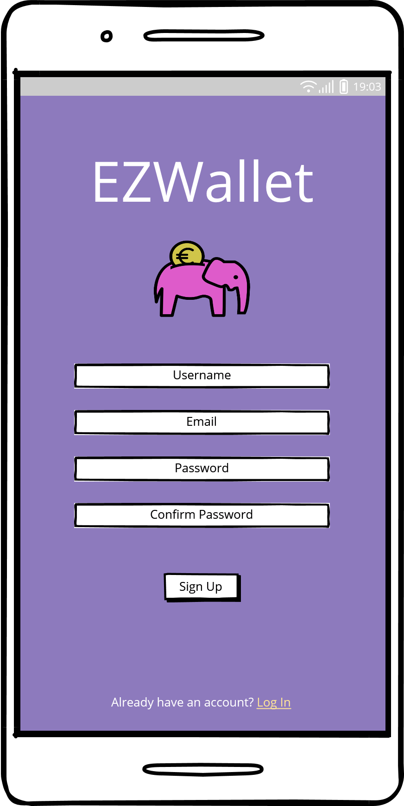
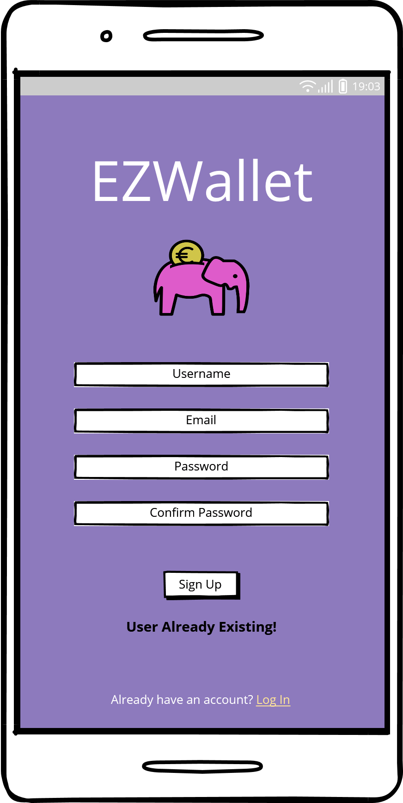
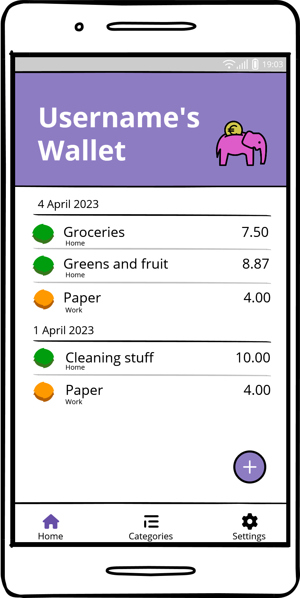
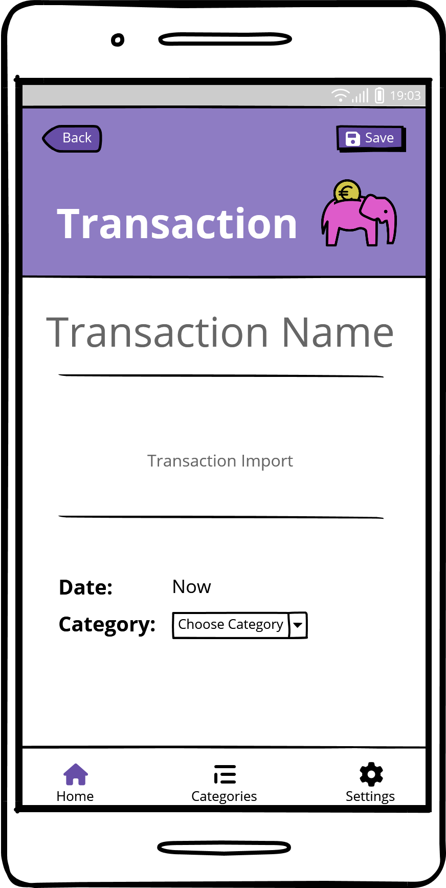
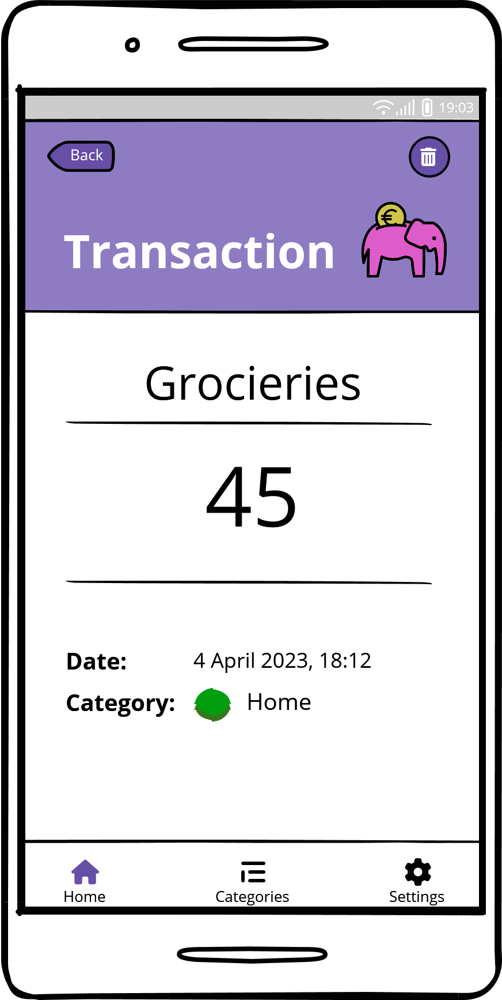
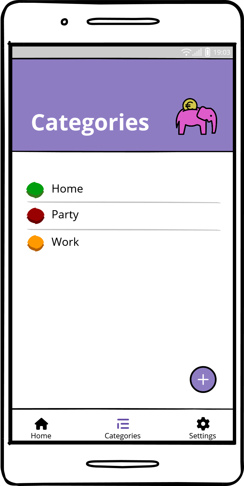
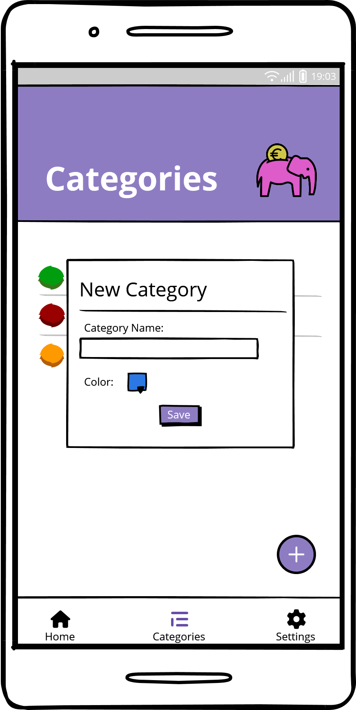
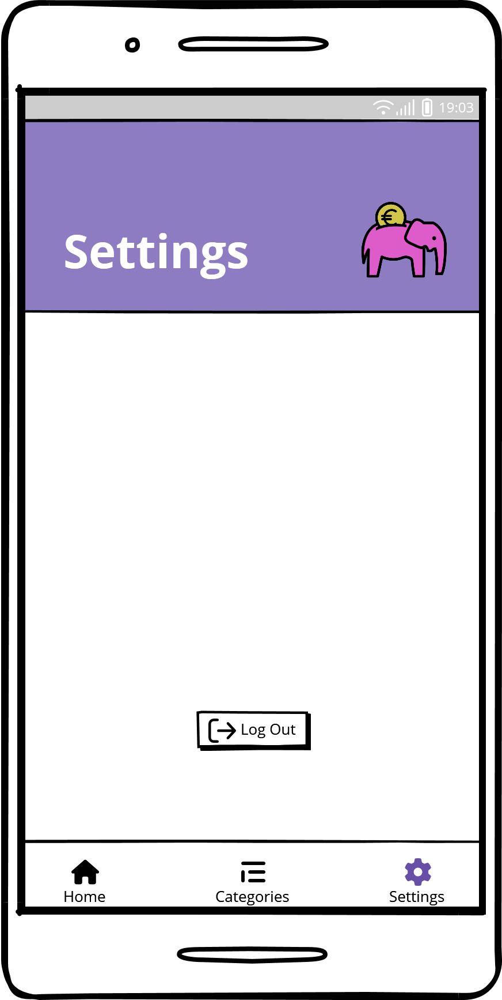

# Graphical User Interface Prototype  - CURRENT

Authors:
Group 40
Date:
2023-04-23
Version:
1

 $~~~~~~~~~~$  $~~~~~~~~~~$ 

$~~~~~~~~~~~~~~~~~~$ Log In Page $~~~~~~~~~~~~~~~~~~~~~~~~~~~~~~~~~~~~~$ Log In Page if email is incorrect $~~~~~~~~~~~~~~~~~$ Log In Page if password is incorrect

 $~~~~~~~~~~$  $~~~~~~~~~~$ 

$~~~~~~~~~~~~~~~~~~$ Sign Up Page $~~~~~~~~~~~~~~~~~~~~~~~~~~~~~~~~~~~~~~~~$ Sign Up if existing user $~~~~~~~~~~~~~~~~~~~~~~~~~~~~~~~~~~~~~~~~~~~~~$ Home Page 

 $~~~~~~~~~~$  $~~~~~~~~~~$ 

$~~~~~~~~~~~$ New transaction page $~~~~~~~~~~~~~~~~~~~~~~~~~~~~~~~~~~$ View transaction $~~~~~~~~~~~~~~~~~~~~~~~~~~~~~~~~~~~~~~~~~~$ Categories page 

 $~~~~~~~~~~$ 

$~~~~~~~~~~~~~~~~~~$ New Category $~~~~~~~~~~~~~~~~~~~~~~~~~~~~~~~~~~~~~~~~~~~~~~~~~~~~~~~$ Settings 
