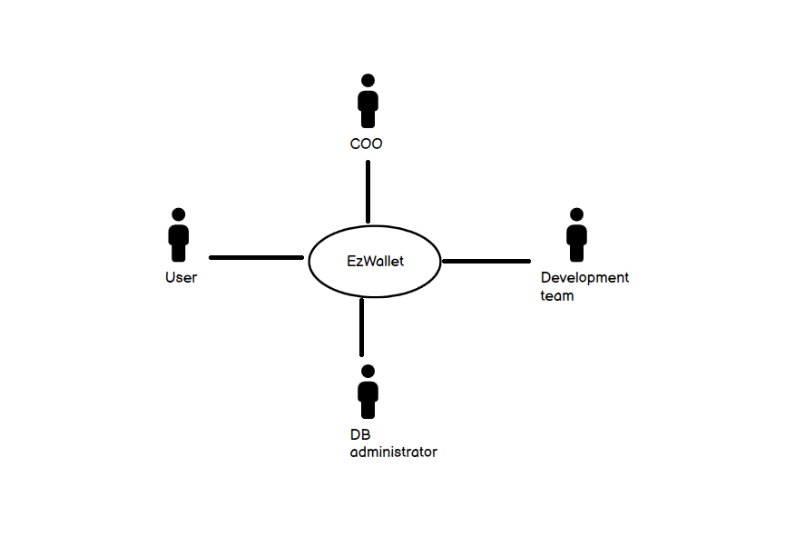
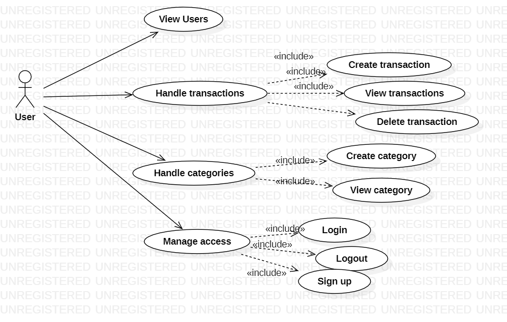
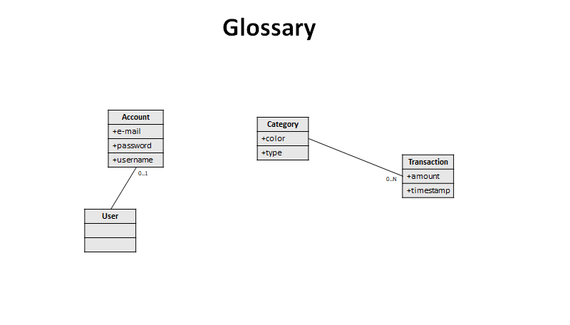
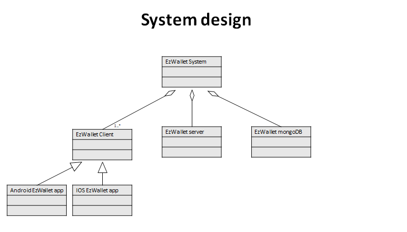
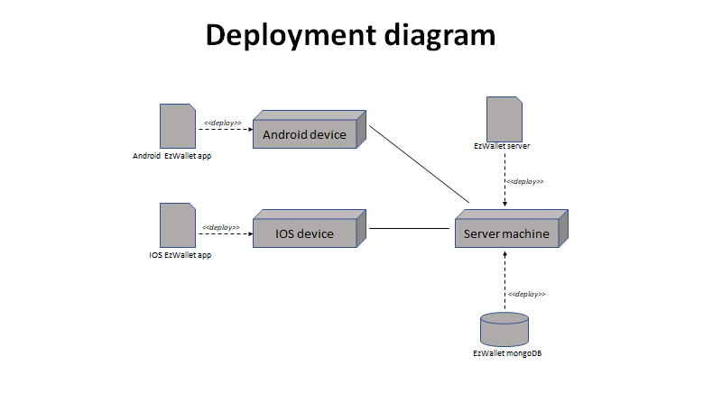

# Requirements Document - current EZWallet

Date: 

Version: V1 - description of EZWallet in CURRENT form (as received by teachers)

 
| Version number | Change |
| ----------------- |:-----------|
| 1 | - | 

# Contents

- [Informal description](#informal-description)
- [Stakeholders](#stakeholders)
- [Context Diagram and interfaces](#context-diagram-and-interfaces)
	+ [Context Diagram](#context-diagram)
	+ [Interfaces](#interfaces) 
	
- [Stories and personas](#stories-and-personas)
- [Functional and non functional requirements](#functional-and-non-functional-requirements)
	+ [Functional Requirements](#functional-requirements)
	+ [Non functional requirements](#non-functional-requirements)
- [Use case diagram and use cases](#use-case-diagram-and-use-cases)
	+ [Use case diagram](#use-case-diagram)
	+ [Use cases](#use-cases)
    	+ [Relevant scenarios](#relevant-scenarios)
- [Glossary](#glossary)
- [System design](#system-design)
- [Deployment diagram](#deployment-diagram)

# Informal description
EZWallet is a web application designed to help individuals and families keep track of their expenses. Users can enter and categorize their expenses, allowing them to quickly see where their money is going. EZWallet is a powerful tool for those looking to take control of their finances and make informed decisions about their spending.

# Stakeholders

| Stakeholder name  | Description | 
| ----------------- |:-----------:|
|       Private users         | User of the application		                             | 
|		COO					  |	Business developer										 |
|       Project manager       | Responsible for project management                       | 
|       Development team      | Responsible for application developement                 | 
|       DB administrator      | Responsible for database management                      | 

# Context Diagram and interfaces

## Context Diagram

## Interfaces
\<GUIs will be described graphically in a separate document>

| Actor | Logical Interface | Physical Interface  |
| ------------- |:-------------:| -----:|
| Private User                | GUI                 | Smartphone      |
| COO		                  | GUI                 | Smartphone      |
| Project manager             | GUI + Control panel | PC / Smartphone |
| Development team            | IDE + Control panel | PC              |
| DB administrator            | DBMS software       | PC              |

# Stories and personas

Person 1:  student, male, single 22 years old, low income
Story:  he needs to keep track of his daily outcome and monitor his monthly finances. He can make smarter decisions about where to spend money.

Persona 2: professional, female, 35 years old, mother of two
Story: she uses the app to manage her outcome manage family expenses.

Persona 3: professional, male, 50 years old, high income
Story: he uses the app to have more awareness of what he spends his money on.

Persona 4: male, 28 years old, is trying to save money
Story: he use the app to analyse his monthly expenses to eliminate all unnecessary expenses

# Functional and non functional requirements

## Functional Requirements

| ID        | Description  |
| ------------- |:-------------:| 
|  FR1     | handle transactions |
| FR1.1	| insert new transaction |
| FR1.2	| remove transaction |
| FR1.3	| display all transactions |
| FR1.4	| display transactions with all informations about the category |
|  FR2     | authenticate  |
| FR2.1 | log in |
| FR2.2	| log out |
| FR2.3	| create new account |
| FR2.4 | display information about account |
|  FR3     | handle category |
| FR3.1 | create new category |
| FR3.2 | display categories |
|  FR4     | display informations about all users |

## Non Functional Requirements

\<Describe constraints on functional requirements>

| ID        | Type (efficiency, reliability, ..)           | Description  | Refers to |
| ------------- |:-------------:| :-----:| -----:|
|  NFR1     | efficiency  | Lasts less than 1s  | FR2 |
|  NFR2     | efficiency | Lasts less than 2s | FR1 |
|  NFR3     | usability | the software must be functional for everyone with no training | - |
| NFR4 | reliability | >99.99% | - | 
| NFR5 | portability | software designed to be compatible with Android and IOS | - |
| NFR6 | robustness | time to restart after failure < 10s | - |
| NFR7 | security | only the admin can access all users' information | - |

In the current version of the software, NFR7 is not satisfied, because each user can call the "getAllUsers" method, thus creating a security problem.
This problem must be solved in V2.

# Use case diagram and use cases

## Use case diagram

\<next describe here each use case in the UCD>
### Use case 1, UC1 (Login)
| Actors Involved        | User |
| ------------- |:-------------:| 
|  Precondition     | user already has an account |
|  Post condition     | user is granted access |
|  Nominal Scenario     | user tries to login in the software |
|  Variants     | - |
|  Exceptions     | wrong credentials, system unavailable |

##### Scenario 1.1 (nominal scenario)
| Scenario 1.1 | |
| ------------- |:-------------:| 
|  Precondition     | user accesses the login page of the software |
|  Post condition     | user's access is granted |
| Step#        | Description  |
| 1 | user accesses the login page of the software |
| 2 | user tries to login in the software inserting the credentials |
| 3 | system retrieves information about the user |
| 4 | system granted access to the user |

##### Scenario 1.2 (exceptional scenario)
| Scenario 1.2 | |
| ------------- |:-------------:| 
|  Precondition     | user accesses the login page of the software |
|  Post condition     | user's access is not granted |
| 1 | user accesses the login page of the software
| 2 | user tries to login in the software inserting the credentials
| 3 | system retrieves information about the user
| 4 | wrong credentials: access not granted

##### Scenario 1.3 (exceptional scenario)
| Scenario 1.3 | |
| ------------- |:-------------:| 
|  Precondition     | user accesses the login page of the software |
|  Post condition     | user's access is not granted |
| 1 | user accesses the login page of the software
| 2 | user tries to login in the software inserting the credentials
| 3 | system unavailable

### Use case 2, UC2 (Sign Up)
| Actors Involved        | User |
| ------------- |:-------------:| 
|  Precondition     | user doesn't have an account |
|  Post condition     | user has an account |
|  Nominal Scenario     | user creates new credentials for its account |
|  Variants     | - |
|  Exceptions     | email already in the db |

##### Scenario 2.1 (nominal scenario)
| Scenario 2.1 | |
| ------------- |:-------------:| 
|  Precondition     | user accesses login page of the software |
|  Post condition     | user created a new account |
| Step#        | Description  |
| 1 | user accesses the login page |
| 2 | user inserts email password |
| 3 | user creates a new password|
| 4 | system retrieves email and password |
| 5 | system checks email and password's validity|
| 6 | a new account is created |

##### Scenario 2.2 (exceptional scenario)
| Scenario 2.2 | |
| ------------- |:-------------:| 
|  Precondition     | user accesses login page of software |
|  Post condition     | account not created |
| Step#        | Description  |
| 1 | user accesses the login page |
| 2 | user inserts email password |
| 3 | user creates a new password|
| 4 | system retrieves email and password |
| 5 | system checks email and password's validity |
| 6 | account not created |

### Use case 3, UC3 (New transaction)
| Actors Involved        | User |
| ------------- |:-------------:| 
|  Precondition     |  Granted access' user is in the home page |
|  Post condition     | A new transaction is inserted |
|  Nominal Scenario     | The user inserts a new expense in its account |
|  Variants     | - |
|  Exceptions     | system unavailable |

##### Scenario 3.1 (nominal scenario)
| Scenario 3.1 | |
| ------------- |:-------------:| 
|  Precondition     | user in the home page |
|  Post condition     | new transaction inserted |
| Step#        | Description  |
| 1 | user creates a new transaction |
| 2 | user inserts the amount |
| 3 | user inserts the expense's category |
| 4 | system retrieves informations about new transaction |
| 5 | system checks new transaction's validity |
| 6 | system creates a new instance into the database |
| 7 | system updates expenses' informations and stats |

##### Scenario 3.2 (exceptional scenario)
| Scenario 3.2 | |
| ------------- |:-------------:| 
|  Precondition     | user in the home page |
|  Post condition     | new transaction not created |
| Step#        | Description  |
| 1 | user creates a new transaction |
| 2 | user inserts the amount |
| 3 | user inserts the expense's category |
| 4 | system retrieves informations about new transaction |
| 5 | system checks new transaction's validity |
| 6 | system prints an error message |
| 7 | transaction not created |

# Glossary

Account and Categories, according to source code, have no connection. However this would make the creation of separated wallets for different users impossible. This was solved in v2.

# System Design

# Deployment Diagram 

