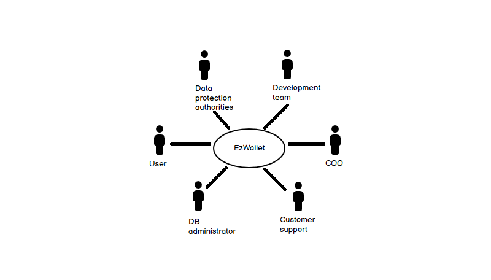
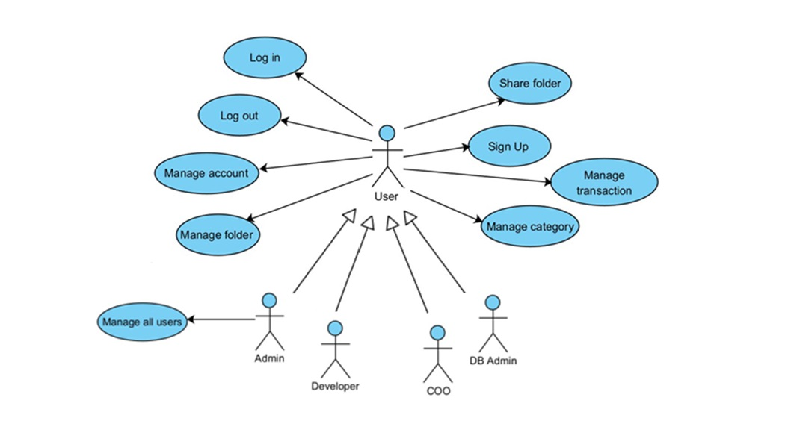
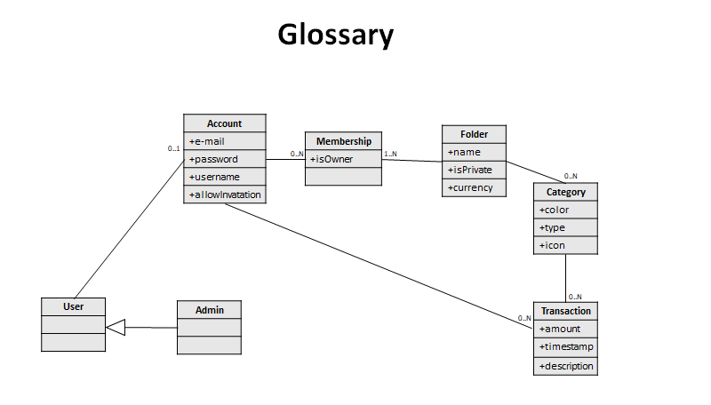
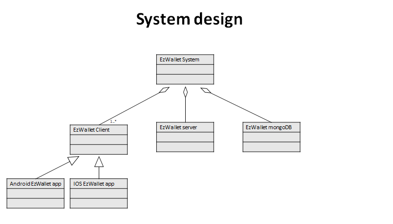
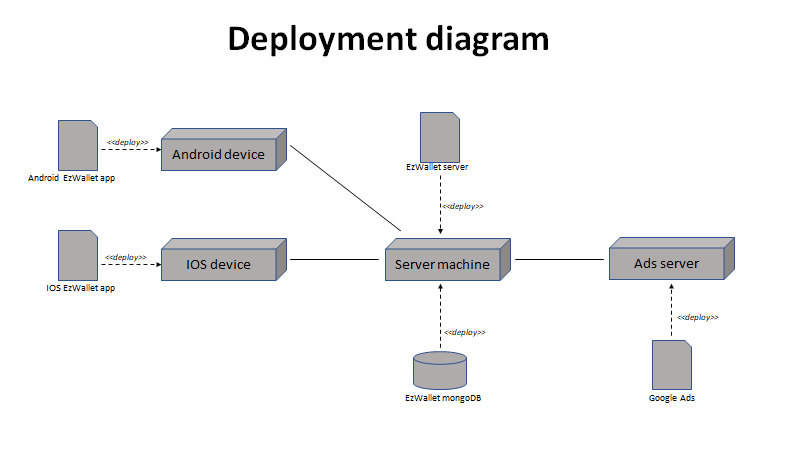

# Requirements Document - current EZWallet

Date: 

Version: V2 - description of EZWallet in FUTURE form (as proposed by the team)

 
| Version number | Change |
| ----------------- |:-----------|
| 1.1 | Security problems solved; added class "Folder" which contains transactions and categories; added possibility to update transactions |
| 1.2 | Shared folders; added statistics; added advertisements; notifications; added customer support (F.A.Q.) | 

# Contents

- [Informal description](#informal-description)
- [Stakeholders](#stakeholders)
- [Context Diagram and interfaces](#context-diagram-and-interfaces)
	+ [Context Diagram](#context-diagram)
	+ [Interfaces](#interfaces) 
	
- [Stories and personas](#stories-and-personas)
- [Functional and non functional requirements](#functional-and-non-functional-requirements)
	+ [Functional Requirements](#functional-requirements)
	+ [Non functional requirements](#non-functional-requirements)
- [Use case diagram and use cases](#use-case-diagram-and-use-cases)
	+ [Use case diagram](#use-case-diagram)
	+ [Use cases](#use-cases)
    	+ [Relevant scenarios](#relevant-scenarios)
- [Glossary](#glossary)
- [System design](#system-design)
- [Deployment diagram](#deployment-diagram)

# Informal description
EZWallet is a software application designed to keep track of expenses. Users can enter their expenses and classify them by category to see where their money is spent. Folders can be created to give a tidier view of one's expenses, with the added option of creating shared folders with friends to better manage expenses at home or on trips. EZWallet also provides statistics that highlight the categories in which each person spends the most over time, making EzWallet a useful tool for those who want to manage their finances and be more aware of how they spend their money.

# Stakeholders

| Stakeholder name  | Description | 
| ----------------- |:-----------:|
|       Private users         | User of the application		                             | 
|		COO					  |	Business developer										 |
|       Project manager       | Responsible for project management                       | 
|       Development team      | Responsible for application developement                 | 
|       DB administrator      | Responsible for database management                      | 
|        Business partners    | Collaboration with other companies                       | 
| Data protection authorities | Responsible for the security of users' personal data | 
|           Admin             | User with privileges                                     |
|        Customer support     | Help customers in case of problems                    |     
|        Advertisement        | Advertising space within the app                         | 

# Context Diagram and interfaces

## Context Diagram

## Interfaces

| Actor | Logical Interface | Physical Interface  |
| ------------- |:-------------:| -----:|
| Private User                | GUI                           | Smartphone        |
| COO		                  | GUI                           | Smartphone        |
| Project manager             | GUI + Control panel           | PC / Smartphone   |
| Development team            | IDE + Control panel           | PC                |
| DB administrator            | DBMS software                 | PC                |
| Business partners           | GUI                           | PC / Smartphone   |
| Data Protection authorities | GUI                           | PC / Smartphone   |
| Admin                       | GUI                           | PC / Smartphone   |
| Customer support            | GUI (FAQ section)                   | Smartphone   |
| Advertisement               | https://developers.google.com/google-ads/api/docs/start |Internet link |

# Stories and personas

Person 1:  student, male, single 22 years old, low income
Story:  he needs to keep track of his daily outcome and monitor his monthly finances. He can make smarter decisions about where to spend money.

Persona 2: professional, female, 35 years old, mother of two
Story: she uses the app to manage her outcome manage family expenses.

Persona 3: professional, male, 50 years old, high income
Story: he uses the app to have more awareness of what he spends his money on.

Persona 4: male, 28 years old, is trying to save money
Story: he use the app to analyse his monthly expenses to eliminate all unnecessary expenses

Person 5: entrepreneur, male, 46 years old, he manages his activity.
Story: he needs to find an app with which he can monitor all his expenses in an orderly manner using personal folders.

Persona 6: young, female, 25 years old, during a vacation with her friends
Story: she needs an app that keeps track of expenses during the holiday, so that common expenses can be divided equally among the group.

Persona 7: male, father, 50 years old
Story: he needs an app that keeps track of all monthly expenses and shows statistics showing where he spends his money.

# Functional and non functional requirements

## Functional Requirements

| ID        | Description  |
| ------------- |:-------------:| 
|  FR1     | handle transactions |
| FR1.1	| insert new transaction |
| FR1.2	| remove transaction |
| FR1.3	| display all transactions |
| FR1.4	| display transactions with all informations about the category |
| FR1.5 | update transaction |
|  FR2     | authenticate  |
| FR2.1 | log in |
| FR2.2	| log out |
| FR2.3	| create new account |
| FR2.4 | update account |
| FR2.5 | delete account |
| FR2.6 | recover password |
| FR2.7 | display information about account |
|  FR3     | handle category |
| FR3.1 | create new category |
| FR3.2 | display categories |
| FR3.3 | update categories |
| FR3.4 | delete category |
|  FR4     | display informations about all users |
| FR5 | handle folder |
| FR5.1 | create new folder |
| FR5.2 | delete existing folder |
| FR5.3 | update existing folder |
| FR5.4 | share folder |
| FR5.5 | display all folders |
| FR5.6 | display folder informations | 
## Non Functional Requirements

| ID        | Type (efficiency, reliability, ..)           | Description  | Refers to |
| ------------- |:-------------:| :-----:| -----:|
|  NFR1     | efficiency  | Lasts less than 1s  | FR2 |
|  NFR2     | efficiency | Lasts less than 1.5s | FR1, FR5 |
|  NFR3     | usability | the software must be functional for everyone with no training | - |
| NFR4 | reliability | >99.99% | - | 
| NFR5 | portability | software designed to be compatible with Android and iOS | - |
| NFR6 | robustness | time to restart after failure < 5s | - |
| NFR7 | security | only the admin can access all users' information | - |

In this version, NFR7 has been solved.

# Use case diagram and use cases

## Use case diagram

### Use case 1, UC1 (Login)
| Actors Involved        | User |
| ------------- |:-------------:| 
|  Precondition     | user already has an account |
|  Post condition     | user is granted access |
|  Nominal Scenario     | user tries to login in the software |
|  Variants     | - |
|  Exceptions     | wrong credentials, system unavailable |

##### Scenario 1.1 (nominal scenario)
| Scenario 1.1 | |
| ------------- |:-------------:| 
|  Precondition     | user accesses the login page of the software |
|  Post condition     | user's access is granted |
| Step#        | Description  |
| 1 | user accesses the login page of the software |
| 2 | user tries to login in the software inserting the credentials |
| 3 | system retrieves information about the user |
| 4 | system granted access to the user |

##### Scenario 1.2 (exceptional scenario)
| Scenario 1.2 | |
| ------------- |:-------------:| 
|  Precondition     | user accesses the login page of the software |
|  Post condition     | user's access is not granted |
| 1 | user accesses the login page of the software
| 2 | user tries to login in the software inserting the credentials
| 3 | system retrieves information about the user
| 4 | wrong credentials: access not granted

##### Scenario 1.3 (exceptional scenario)
| Scenario 1.3 | |
| ------------- |:-------------:| 
|  Precondition     | user accesses the login page of the software |
|  Post condition     | user's access is not granted |
| 1 | user accesses the login page of the software
| 2 | user tries to login in the software inserting the credentials
| 3 | system unavailable

### Use case 2, UC2 (Sign Up)
| Actors Involved        | User |
| ------------- |:-------------:| 
|  Precondition     | user doesn't have an account |
|  Post condition     | user has an account |
|  Nominal Scenario     | user creates new credentials for its account |
|  Variants     | - |
|  Exceptions     | email already in the db |

##### Scenario 2.1 (nominal scenario)
| Scenario 2.1 | |
| ------------- |:-------------:| 
|  Precondition     | user accesses login page of the software |
|  Post condition     | user created a new account |
| Step#        | Description  |
| 1 | user accesses the login page |
| 2 | user inserts email password |
| 3 | user creates a new password|
| 4 | system retrieves email and password |
| 5 | system checks email and password's validity|
| 6 | a new account is created |

##### Scenario 2.2 (exceptional scenario)
| Scenario 2.2 | |
| ------------- |:-------------:| 
|  Precondition     | user accesses login page of software |
|  Post condition     | account not created |
| Step#        | Description  |
| 1 | user accesses the login page |
| 2 | user inserts email password |
| 3 | user creates a new password|
| 4 | system retrieves email and password |
| 5 | system checks email and password's validity |
| 6 | account not created |

### Use case 3, UC3 (New transaction)
| Actors Involved        | User |
| ------------- |:-------------:| 
|  Precondition     |  Granted access' user is in the home page |
|  Post condition     | A new transaction is inserted |
|  Nominal Scenario     | The user inserts a new expense in its account |
|  Variants     | - |
|  Exceptions     | system unavailable |

##### Scenario 3.1 (nominal scenario)
| Scenario 3.1 | |
| ------------- |:-------------:| 
|  Precondition     | user in the home page |
|  Post condition     | new transaction inserted |
| Step#        | Description  |
| 1 | user creates a new transaction |
| 2 | user inserts the amount |
| 3 | user inserts the expense's category |
| 4 | system retrieves informations about new transaction |
| 5 | system checks new transaction's validity |
| 6 | system creates a new instance into the database |
| 7 | system updates expenses' informations and stats |

##### Scenario 3.2 (exceptional scenario)
| Scenario 3.2 | |
| ------------- |:-------------:| 
|  Precondition     | user in the home page |
|  Post condition     | new transaction not created |
| Step#        | Description  |
| 1 | user creates a new transaction |
| 2 | user inserts the amount |
| 3 | user inserts the expense's category |
| 4 | system retrieves informations about new transaction |
| 5 | system checks new transaction's validity |
| 6 | system prints an error message |
| 7 | transaction not created |

### Use case 4, UC4 (Handle transaction)
| Actors Involved        | User |
| ------------- |:-------------:| 
|  Precondition     |  Granted access' user is in the home page |
|  Post condition     | The transaction is updated |
|  Nominal Scenario     | The user manages an expense in its account |
|  Variants     | The user deletes the expense |
|  Exceptions     | system unavailable |

##### Scenario 4.1 (nominal scenario)
| Scenario 4.1 | |
| ------------- |:-------------:| 
|  Precondition     | user in the home page |
|  Post condition     | transaction updated |
| Step#        | Description  |
| 1 | user selects the transaction to be changed |
| 2 | user changes the transaction |
| 3 | system retrieves informations about changes | 
| 4 | system checks changes |
| 5 | system updates transaction | 
| 6 | system displays message |

##### Scenario 4.2 (variant scenario)
| Scenario 4.2 | |
| ------------- |:-------------:| 
|  Precondition     | user in the home page |
|  Post condition     | transaction updated |
| Step#        | Description  |
| 1 | user selects the transaction to be removed |
| 2 | user removes the transaction |
| 3 | system removes the transaction | 
| 4 | system displays message |

### Use Case 5 (Handle folder)
| Actors Involved        | User |
| ------------- |:-------------:| 
|  Precondition     |  Granted access' user is in the home page |
|  Post condition     | One folder is created |
|  Nominal Scenario     | The user manages a folder in its account |
|  Variants     | The user deletes the folder |
|  Exceptions     | system unavailable |

##### Scenario 5.1 (nominal scenario)
| Scenario 5.1 | |
| ------------- |:-------------:| 
|  Precondition     | user in the home page |
|  Post condition     | folder created |
| Step#        | Description  |
| 1 | user inserts new folder's name |
| 2 | user confirm new folder's creation |
| 3 | system creates new folder |
| 4 | system displays message |

##### Scenario 5.2 (variant scenario)
| Scenario 5.2 | |
| ------------- |:-------------:| 
|  Precondition     | user in the home page |
|  Post condition     | folder deleted |
| Step#        | Description  |
| 1 | user selects the folder to be deleted |
| 2 | system displays a message |
| 3 | user confirms the deletion | 
| 4 | system deletes folder |

### Use Case 6 (Share folder)
| Actors Involved        | User |
| ------------- |:-------------:| 
|  Precondition     |  User is in the home page |
|  Post condition     | One of more users is granted access' to another user's folder |
|  Nominal Scenario     | The user shares one of his folders |
|  Variants     | user joins folder |
|  Exceptions     | email doesn't belong to any account |

##### Scenario 6.1 (nominal scenario)
| Scenario 6.1 | |
| ------------- |:-------------:| 
|  Precondition     | user in the home page |
|  Post condition     | folder shared |
| Step#        | Description  |
| 1 | user selects one of his folders |
| 2 | user writes email of the account he wants to invite |
| 3 | system checks that the email belongs to an user |
| 4 | system sends notification to invited user |
| 5 | system displays message |

##### Scenario 6.2 (variant scenario)
| Scenario 6.2 | |
| ------------- |:-------------:| 
|  Precondition     | user in the home page |
|  Post condition     | user accepted/denied invite |
| Step#        | Description  |
| 1 | user goes to notification panel |
| 2 | system displays invite notification |
| 3 | user accepts or denies the invite | 
| 4 | system retrieves information |
| 5 | system sends notification about to folder's owner | 
| 6 | system displays message |

##### Scenario 6.3 (exceptional scenario)
| Scenario 6.3 | |
| ------------- |:-------------:| 
|  Precondition     | user in the home page |
|  Post condition     | invite not sent |
| Step#        | Description  |
| 1 | user selects one of his folders |
| 2 | user writes email of the account he wants to invite |
| 3 | system checks that the email belongs to an user |
| 4 | system displays error message about email |

# Glossary

# System Design

# Deployment Diagram 

