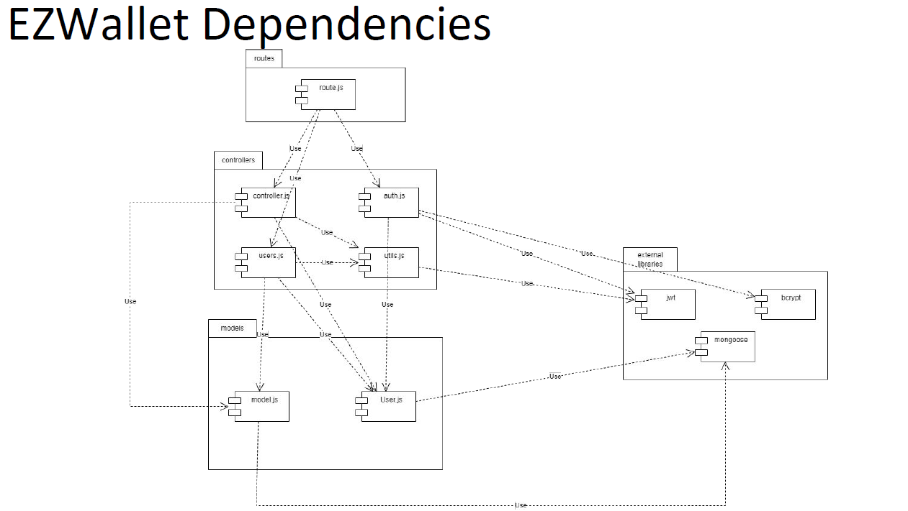
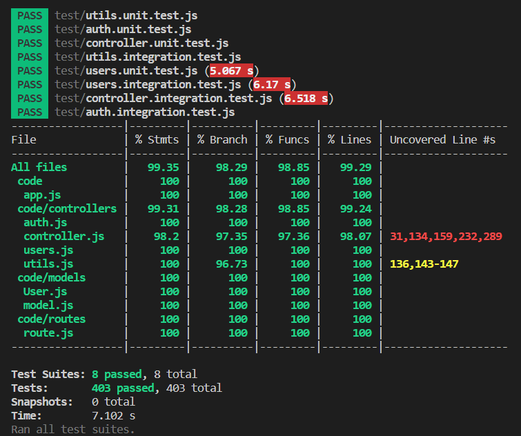

# Test Report

<The goal of this document is to explain how the application was tested, detailing how the test cases were defined and what they cover>

# Contents

- [Dependency graph](#dependency-graph)

- [Integration approach](#integration-approach)

- [Tests](#tests)

- [Coverage](#Coverage)

# Dependency graph 

     
# Integration approach

    <Write here the integration sequence you adopted, in general terms (top down, bottom up, mixed) and as sequence
    (ex: step1: unit A, step 2: unit A+B, step 3: unit A+B+C, etc)> 
    <Some steps may  correspond to unit testing (ex step1 in ex above)>
    <One step will  correspond to API testing, or testing unit route.js>

    The approach for performing integration tests is top down.

     • Step 1, A+B:
     Testing all the APIs with integration tests covering all the modules of the system:
     A: function in controller.js, auth.js, user.js
     B: functions in utils.js;

     • Step 2, B:
     Testing the functions in controller.js, auth.js, user.js mocking all the dependencies (in unit test)

     • Step 3, A: 
     Testing the functions in utils.js mocking all the dependencies (in unit test)
    

# Tests

   <in the table below list the test cases defined For each test report the object tested, the test level (API, integration, unit) and the technique used to define the test case  (BB/ eq partitioning, BB/ boundary, WB/ statement coverage, etc)>   <split the table if needed>

| Test case name | Object(s) tested | Test level | Technique used |
|--|--|--|--|
| should return 500 for internal server error | register | unit | WB |
| req body does not contain all informations | register | unit | WB |
| one of attributes is empty | register | unit | WB |
| email not correct format | register | unit | WB |
| user already registered | register | unit | WB |
| email already registered | register | unit | WB |
| correct registration | register | unit | WB |
| user already registered | register | API | BB |
| email already registered | register | API | BB |
| correct registration | register | API | BB |
| should return 500 for internal server error | registerAdmin | unit | WB |
| req body does not contain all informations | registerAdmin | unit | WB |
| one of attributes is empty | registerAdmin | unit | WB |
| email not correct format | registerAdmin | unit | WB |
| user already registered | registerAdmin | unit | WB |
| email already registered | registerAdmin | unit | WB |
| correct registration | registerAdmin | unit | WB |
| missing attributes | register | API | BB |
| empty string | register | API | BB |
| email not in a valid format | register | API | BB |
| user already registered | register | API | BB |
| email already registered | register | API | BB |
| correct registration | register | API | BB |
| should return 500 for internal server error | login | unit | WB |
| req body does not contain all informations | login | unit | WB |
| one of attributes is empty | login | unit | WB |
| email not correct format | login | unit | WB |
| you are already logged in | login | unit | WB |
| password does not match | login | unit | WB |
| correct registration | login | unit | WB |
| missing attributes | register | API | BB |
| empty string | register | API | BB |
| email not in a valid format | register | API | BB |
| user does not exist | register | API | BB |
| password does not match | register | API | BB |
| you re already logged in | register | API | BB |
| correct login | register | API | BB |
| should return 500 for internal server error | logout | unit | WB |
| cookie not found | logout | unit | WB |
| one of attributes is empty | logout | unit | WB |
| email not correct format | logout | unit | WB |
| user not found | logout | API | BB |
| successfully logged out | logout | API | BB |
| should return 500 for internal server error | getUsers | unit | WB |
| verifyauth test | getUsers | unit | WB |
| should return empty list if there are no users | getUsers | unit | WB/boundary|
| should retrieve list of all users | getUsers | unit | WB |
| not an Admin | getUsers | API | BB |
| no users in database | getUsers | API | BB |
| users correcly returned | getUsers | API | BB |
| should return 500 for internal server error | getUser | unit | WB |
| verifyauth test | getUser | unit | WB |
| should return Unauthorized if the requested username does not match the user in the database | getUser | unit | WB/boundary|
| username not in the database | getUser | unit | WB |
| should return the user if all conditions are met | getUser | unit | WB |
| user is not in database | getUser | API | BB |
| cookie does not match with username | getUser | API | BB |
| correct execution | getUser | API | BB |
| unauthorized | getUser | API | BB |
| should return 500 for internal server error | createGroup | unit | WB |
| verifyauth test | createGroup | unit | WB |
| missing attributes | createGroup | unit | WB |
| name passed is empty | createGroup | unit | WB/boundary|
| should return an error message if user is not found | createGroup | unit | WB |
| user already in a group | createGroup | unit | WB |
| should return an error message if one or more members are already in a group | createGroup | unit | WB |
| one or more email is empty | createGroup | unit | WB |
| error message if one or more email is is wrong format | createGroup | unit | WB |
| Emails do not exist or are already in other groups | createGroup | unit | WB |
| should create a new group when all members are valid | createGroup | unit | WB |
| should create a new group when all members are valid (different path taken) | createGroup | unit | WB |
| group with this name already exists | createGroup | unit | WB |
| not all attributes | createGroup | unit | BB |
| name is an empty string | createGroup | API | BB |
| there is already a group with the same name | createGroup | API | BB |
| no valid user | createGroup | API | BB |
| user is already in a group | createGroup | API | BB |
| wrong email format | createGroup | API | BB |
| empty email | createGroup | API | BB |
| user not autenthicated | createGroup | API | BB |
| group correctly added and user email added | createGroup | API | BB |
| should return 500 for internal server error | getGroups | unit | WB |
| verifyauth test | getGroups | unit | WB |
| should return a list of groups indicating success | getGroups | unit | WB |
| should return an empty array if there are no groups | getGroups | unit | WB/boundary |
| correct execution | getGroups | API | BB |
| not an admin calling | getGroups | API | BB |
| should return 500 for internal server error | getGroup | unit | WB |
| should return 401 for unauthorized authentication | getGroup | unit | WB |
| returns a group | getGroup | unit | WB |
| returns 400: group does not exist | getGroup | unit | WB |
| group is not in database | getGroup | API | BB |
| Unauthorized | getGroup | API | BB |
| Group correctly retrieved | getGroup | API | BB |
| should return 500 for internal server error | addToGroup | unit | WB |
| Authentication failed (with path /groups/:name/add) | addToGroup | unit | WB |
| Authentication failed (with path /groups/:name/insert) | addToGroup | unit | WB |
| missing attributes | addToGroup | unit | WB |
| group does not exist | addToGroup | unit | WB |
| email cannot be empty | addToGroup | unit | WB |
| email in wrong format | addToGroup | unit | WB |
| all emails are not valid or in other groups | addToGroup | unit | WB |
| correct execution: added emails to group | addToGroup | unit | WB |
| missing attributes | addToGroup | unit | BB |
| empty string | addToGroup | API | BB |
| email not in a valid format | addToGroup | API | BB |
| group does not exist | addToGroup | API | BB |
| all emails already in a group or do not exist | addToGroup | API | BB |
| user not in the group | addToGroup | API | BB |
| user not an admin | addToGroup | API | BB |
| 200 OK | addToGroup | API | BB |
| should return 500 for internal server error | removeFromGroup | unit | WB |
| Authentication failed (with path /groups/:name/pull) | removeFromGroup | unit | WB |
| Authentication failed (with path /groups/:name/remove) | removeFromGroup | unit | WB |
| missing attributes | removeFromGroup | unit | WB |
| group does not exist | removeFromGroup | unit | WB |
| email cannot be empty | removeFromGroup | unit | WB |
| email in wrong format | removeFromGroup | unit | WB |
| all emails are not valid or in other groups | removeFromGroup | unit | WB |
| remove correctly from database | removeFromGroup | unit | WB |
| Insert at least one valid member to delete (while loop) | removeFromGroup | unit | WB |
| Missing attributes | removeFromGroup | unit | BB |
| Group does not exist | removeFromGroup | API | BB |
| Insert at least one valid member to delete | removeFromGroup | API | BB |
| one of the emails is not valid | removeFromGroup | API | BB |
| not an admin | removeFromGroup | API | BB |
| email cannot be empty | removeFromGroup | API | BB |
| user not in group | removeFromGroup | API | BB |
| users correctly deleted | removeFromGroup | API | BB |
| should return 500 for internal server error | deleteUser | unit | WB |
| verifyauth test | deleteUser | unit | WB |
| missing attributes | deleteUser | unit | WB |
| user does not exist | deleteUser | unit | WB |
| email cannot be empty | deleteUser | unit | WB |
| email in wrong format | deleteUser | unit | WB |
| admins cannot be deleted | deleteUser | unit | WB |
| user correctly deleted | deleteUser | unit | WB |
| user correctly deleted (+ removed from group condition) | deleteUser | unit | WB |
| missing attributes | deleteUser | unit | BB |
| empty string | deleteUser | API | BB |
| email not in a valid format | deleteUser | API | BB |
| user does not exist | deleteUser | API | BB |
| admin cannot be deleted | deleteUser | API | BB |
| user not an admin | deleteUser | API | BB |
| 200 OK | deleteUser | API | BB |
| should return 500 for internal server error | deleteGroup | unit | WB |
| verifyauth test | deleteGroup | unit | WB |
| missing attributes | deleteGroup | unit | WB |
| Group does not exist | deleteGroup | unit | WB |
| name cannot be empty | deleteGroup | unit | WB |
| group deleted correctly | deleteGroup | unit | WB |
| missing attributes | deleteGroup | unit | BB |
| empty string | deleteGroup | API | BB |
| not a group in database | deleteGroup | API | BB |
| not an admin | deleteGroup | API | BB |
| group deleted successfully | deleteGroup | API | BB |
| should return 400 for null value | createCategory | API | BB/ boundary |
| should return 200 for create a new category | createCategory | API | BB |
| should return 400 for missing type or color | createCategory | API | BB/ boundary | 
| should return 400 for existing category | createCategory | API | BB |
| should return 401 for unauthorized authentication | createCategory | API | BB |
| should return 401 for unauthorized user authentication | createCategory | API | BB |
| should return 400 for null value | updateCategory | API | BB/ boundary |
| should return 401 for unauthorized authentication | updateCategory | API | BB | 
| should return 400 for invalid parameters | updateCategory | API | BB/ boundary | 
| should return 400 for existing category | updateCategory | API | BB | 
| should return 400 for category not found | updateCategory | API | BB | 
| should return 200 for update transactions and return success message | updateCategory | API | BB |
| should return 400 for null value | deleteCategory | API | BB/ boundary |
| should return 401 for unauthorized authentication | deleteCategory | API | BB | 
| should return 400 for invalid values | deleteCategory | API | BB/ boundary | 
| should return 400 for only one category not deletable | deleteCategory | API | BB | 
| should return 400 for non-existing categories | deleteCategory | API | BB | 
| should return 200 for delete categories except one and update transactions | deleteCategory | API | BB | 
| should return 200 for trying delete all categories and update transactions | deleteCategory | API | BB | 
| should return 200 for get categories successfully | getCategories | API | BB | 
| should return 401 for unauthorized authentication | getCategories | API | BB | 
| should return 400 for null value | createTransaction | API | BB/ boundary |
| should return 401 for unauthorized authentication | createTransaction | API | BB | 
| should return 200 for create a new transaction | createTransaction | API | BB | 
| should return 400 if parameters are missing | createTransaction | API | BB/ boundary | 
| should return 400 if username in body does not match username in params | createTransaction | API | BB | 
| should return 400 if user does not exist | createTransaction | API | BB | 
| should return 400 if category does not exist | createTransaction | API | BB | 
| should return 200 for returning all transactions with category information successfully | getAllTransactions | API | BB | 
| should return 401 for unauthorized authentication | getAllTransactions | API | BB | 
| should return transactions if called by regular user | getTransactionsByUser | API | BB | 
| should return transactions if called by admin user | getTransactionsByUser | API | BB | 
| should return filtered transactions by date "from" if called by regular user | getTransactionsByUser | API | BB | 
| should return filtered transactions by date "upTo" if called by regular user | getTransactionsByUser | API | BB | 
| should return filtered transactions by date "from" and "upTo" if called by regular user | getTransactionsByUser | API | BB | 
| should return filtered transactions by "date" if called by regular user | getTransactionsByUser | API | BB | 
| should return 400 if 'date' and 'upTo' or 'From' are passed simultaneously | getTransactionsByUser | API | BB | 
| should return 400 if 'date' is not valid | getTransactionsByUser | API | BB | 
| should return 400 if 'from' is not valid | getTransactionsByUser | API | BB | 
| should return 400 if 'upTo' is not valid | getTransactionsByUser | API | BB | 
| should return 400 if 'upTo' or 'From' are not valid | getTransactionsByUser | API | BB | 
| should return filtered transactions by amount "min" if called by regular user | getTransactionsByUser | API | BB | 
| should return filtered transactions by amount "max" if called by regular user | getTransactionsByUser | API | BB | 
| should return filtered transactions by amount "min" and "max" if called by regular user | getTransactionsByUser | API | BB | 
| should return 400 if 'min' is not valid | getTransactionsByUser | API | BB | 
| should return 400 if 'max' is not valid | getTransactionsByUser | API | BB | 
| should return 400 if 'min' or 'max' are not valid | getTransactionsByUser | API | BB | 
| should return 401 if no cookies are passed | getTransactionsByUser | API | BB | 
| should return 401 if regular user tries to access admin path | getTransactionsByUser | API | BB | 
| should return 401 if regular user tries to access other user transactions | getTransactionsByUser | API | BB | 
| should return 400 if the user does not exist | getTransactionsByUser | API | BB | 
| should return transactions if called by regular user | getTransactionsByUserByCategory | API | BB | 
| should return transactions if called by admin user | getTransactionsByUserByCategory | API | BB | 
| should return 401 if no cookies are passed | getTransactionsByUserByCategory | API | BB | 
| should return 401 if regular user tries to access admin path | getTransactionsByUserByCategory | API | BB | 
| should return 401 if regular user tries to access other user transactions | getTransactionsByUserByCategory | API | BB | 
| should return 400 if the user does not exist | getTransactionsByUserByCategory | API | BB | 
| should return 400 if the category does not exist | getTransactionsByUserByCategory | API | BB | 
| should return transactions if called by regular user | getTransactionsByGroup | API | BB | 
| should return transactions if called by admin user | getTransactionsByGroup | API | BB | 
| should return 401 if no cookies are passed | getTransactionsByGroup | API | BB | 
| should return 401 if regular user tries to access admin path | getTransactionsByGroup | API | BB | 
| should return 401 if regular user tries to access other groups transactions | getTransactionsByGroup | API | BB | 
| should return 400 if the group does not exist | getTransactionsByGroup | API | BB | 
| should return transactions if called by regular user | getTransactionsByGroupByCategory | API | BB | 
| should return transactions if called by admin user | getTransactionsByGroupByCategory | API | BB | 
| should return 401 if no cookies are passed | getTransactionsByGroupByCategory | API | BB | 
| should return 401 if regular user tries to access admin path- | getTransactionsByGroupByCategory | API | BB | 
| should return 401 if regular user tries to access other groups transactions | getTransactionsByGroupByCategory | API | BB | 
| should return 400 if the group does not exist | getTransactionsByGroupByCategory | API | BB | 
| should return 400 if the category does not exist | getTransactionsByGroupByCategory | API | BB | 
| should return error if values are null | deleteTransaction | API | BB | 
| should return 200 for deleted transaction | deleteTransaction | API | BB | 
| should return 400 for invalid values | deleteTransaction | API | BB/ boundary | 
| should return 401 if no cookies | deleteTransaction | API | BB | 
| should return 401 if user is not allowed | deleteTransaction | API | BB | 
| should return 400 if user doesn't exist | deleteTransaction | API | BB | 
| should return 400 if transaction doesn't exist | deleteTransaction | API | BB | 
| should return 400 if transaction doesn't belong to user | deleteTransaction | API | BB | 
| should return error if at least one of _ids is empty | deleteTransactions | API | BB | 
| should return 200 for deleted transactions | deleteTransactions | API | BB | 
| should return 400 if no _ids is passed | deleteTransactions | API | BB/ boundary | 
| should return 400 if one _id is corrupted | deleteTransactions | API | BB/ boundary | 
| should return 400 if one or more transaction is not found | deleteTransactions | API | BB | 
| should return 401 if no cookies | deleteTransactions | API | BB | 
| should return 401 if user is not admin | deleteTransactions | API | BB | 
| should return 400 for null value | createCategory | unit | WB/ boundary  |
| should return 200 for create a new category | createCategory | unit | WB | 
| should return 401 for unauthorized authentication | createCategory | unit | WB | 
| should return 400 for missing type or color | createCategory | unit | WB/ boundary | 
| should return 400 for existing category | createCategory | unit | WB | 
| should return 500 for internal server error | createCategory | unit | WB | 
| should return 400 for null value | updateCategory | unit | WB/ boundary  |
| should return 401 for unauthorized authentication | updateCategory | unit | WB | 
| should return 400 for invalid parameters | updateCategory | unit | WB/ boundary | 
| should return 400 for existing category | updateCategory | unit | WB | 
| should return 400 for category not found | updateCategory | unit | WB | 
| should return 200 for update transactions and return success message | updateCategory | unit | WB | 
| should return 500 for internal server error | updateCategory | unit | WB | 
| should return 400 for null value | deleteCategory | unit | WB/ boundary  |
| should return 401 for unauthorized authentication | deleteCategory | unit | WB | 
| should return 400 for invalid values | deleteCategory | unit | WB/ boundary | 
| should return 400 for only one category not deletable | deleteCategory | unit | WB | 
| should return 400 for non-existing categories | deleteCategory | unit | WB | 
| should return 200 for delete categories except one and update transactions | deleteCategory | unit | WB | 
| should return 200 for trying delete all categories and update transactions | deleteCategory | unit | WB | 
| should return 500 for internal server error | deleteCategory | unit | WB | 
| should return 200 for get categories successfully | getCategories | unit | WB | 
| should return 401 for unauthorized authentication | getCategories | unit | WB | 
| should return 500 for internal server error | getCategories | unit | WB | 
| should return 400 for null value | createTransaction | unit | WB/ boundary |
| should return 401 for unauthorized authentication | createTransaction | unit | WB | 
| should return 200 for create a new transaction | createTransaction | unit | WB | 
| should return 400 if parameters are missing | createTransaction | unit | WB/ boundary | 
| should return 400 if username in body does not match username in params | createTransaction | unit | WB | 
| should return 400 if user does not exist | createTransaction | unit | WB | 
| should return 400 if category does not exist | createTransaction | unit | WB | 
| should return 500 if save operation fails | createTransaction | unit | WB | 
| should return 200 for return all transactions with category information successfully | getAllTransactions | unit | WB | 
| should return 401 for unauthorized authentication | getAllTransactions | unit | WB | 
| should return 500 for internal server error | getAllTransactions | unit | WB | 
| should return empty list if there are no transaction made by a regular user | getTransactionsByUser | unit | WB | 
| should return empty list if there are no transaction made by a admin user | getTransactionsByUser | unit | WB | 
| should unauthorized user | getTransactionsByUser | unit | WB | 
| should return 401 if regular user try to access admin user path | getTransactionsByUser | unit | WB | 
| should return error if the user is not found | getTransactionsByUser | unit | WB | 
| should return transactions | getTransactionsByUser | unit | WB | 
| should return 500 for internal server error | getTransactionsByUser | unit | WB | 
| should return transactions if query params are passed | getTransactionsByUser | unit | WB | 
| should return 400 if filters fail | getTransactionsByUser | unit | WB | 
| should return empty list if there are no transaction made by a regular user | getTransactionsByUserByCategory | unit | WB | 
| should return empty list if there are no transaction made by a admin user | getTransactionsByUserByCategory | unit | WB | 
| should return 401 if regular user try to access admin user path | getTransactionsByUserByCategory | unit | WB | 
| should unauthorized user | getTransactionsByUserByCategory | unit | WB | 
| should return error if the user is not found | getTransactionsByUserByCategory | unit | WB | 
| should return error if the catrgory is not found | getTransactionsByUserByCategory | unit | WB | 
| should return transactions | getTransactionsByUserByCategory | unit | WB | 
| should return 500 for internal server error | getTransactionsByUserByCategory | unit | WB | 
| should return empty list if there are no transaction made by a regular user | getTransactionsByGroup | unit | WB | 
| should return empty list if there are no transaction made by a admin user | getTransactionsByGroup | unit | WB | 
| should return 401 if regular user try to access admin user path | getTransactionsByGroup | unit | WB | 
| should unauthorized user | getTransactionsByGroup | unit | WB | 
| should return error if the group is not found | getTransactionsByGroup | unit | WB | 
| should return transactions | getTransactionsByGroup | unit | WB | 
| should return 500 for internal server error | getTransactionsByGroup | unit | WB | 
| should return empty list if there are no transaction made by a regular user | getTransactionsByGroupByCategory | unit | WB | 
| should return empty list if there are no transaction made by a admin user | getTransactionsByGroupByCategory | unit | WB |
| should return 401 if regular user try to access admin user path | getTransactionsByGroupByCategory | unit | WB | 
| should return unauthorized user | getTransactionsByGroupByCategory | unit | WB | 
| should return error if the group is not found | getTransactionsByGroupByCategory | unit | WB | 
| should return error if the catrgory is not found | getTransactionsByGroupByCategory | unit | WB | 
| should return transactions | getTransactionsByGroupByCategory | unit | WB | 
| should return 500 for internal server error | getTransactionsByGroupByCategory | unit | WB | 
| should return error if values are not valid | deleteTransaction | unit | WB/ boundary | 
| should return error if user does not exist | deleteTransaction | unit | WB | 
| should return error if the user is unauthorized | deleteTransaction | unit | WB | 
| should return ok message | deleteTransaction | unit | WB | 
| should return error message because the transaction was not found | deleteTransaction | unit | WB | 
| should return error message if the transaction to be deleted does not belong to the user | deleteTransaction | unit | WB | 
| should return 500 for internal server error | deleteTransaction | unit | WB | 
| should return error if _id is undefined | deleteTransactions | unit | WB/ boundary | 
| should return error if at least one of _ids is undefined | deleteTransactions | unit | WB/ boundary | 
| should return error if deleteMany does not work | deleteTransactions | unit | WB/ boundary | 
| should return error if user is not admin | deleteTransactions | unit | WB | 
| should return error if at least one category is not found | deleteTransactions | unit | WB | 
| should return ok message | deleteTransactions | unit | WB | 
| should return 500 for internal server error | deleteTransactions | unit | WB | 
| should return $gte with the date at midnight and $lte with the date 1 minute before the next midnight | handleDateFilterParams | unit | WB | 
| should return $gte with the from date at midnight and $lte with the upTo date 1 minute before the next midnight | handleDateFilterParams | unit | WB | 
| should return $gte with the from date at midnight | handleDateFilterParams | unit | WB | 
| should return $lte with the upTo date 1 minute before the next midnight | handleDateFilterParams | unit | WB | 
| should return error if the argument passed in 'date' in the correct format | handleDateFilterParams | unit | WB | 
| should return error if the argument passed in 'from' or 'upTo' are not in the correct format | handleDateFilterParams | unit | WB | 
| should return error if the argument passed in 'from' is not in the correct format | handleDateFilterParams | unit | WB | 
| should return error if the argument passed in 'from' in the correct format | handleDateFilterParams | unit | WB | 
| should return error if the argument passed in 'upTo' in the correct format | handleDateFilterParams | unit | WB | 
| should return {} if no date parameters are provided | handleDateFilterParams | unit | WB/ boundary | 
| should throw an error if 'date' parameter is used together with 'from' or 'upTo' | handleDateFilterParams | unit | WB | 
| should return unauthorized if accessToken or refreshToken is missing | verifyAuth | unit | WB | 
| should return unauthorized if accessToken is missing information | verifyAuth | unit | WB | 
| should return unauthorized if  refreshToken is missing information | verifyAuth | unit | WB | 
| should return unauthorized if accessToken and refreshToken have mismatched users | verifyAuth | unit | WB | 
| should return unauthorized if authType is invalid | verifyAuth | unit | WB | 
| should return authorized if ok | verifyAuth | unit | WB | 
| should return unauthorized if user is not allowed for authType = User | verifyAuth | unit | WB | 
| should return unauthorized if regular user is not allowed for authType = Admin | verifyAuth | unit | WB | 
| should return unauthorized if user is not in the group for authType = Group | verifyAuth | unit | WB | 
| should return unauthorized if accessToken is expired and refreshToken is also expired | verifyAuth | unit | WB | 
| should return unauthorized if jwt.verify throws an unidentified error | verifyAuth | unit | WB | 
| should return authorized if accessToken is expired but refreshToken is refreshed | verifyAuth | unit | WB | 
| should return unauthorized if accessToken is expired but refreshToken is refreshed but user is not allowed for authType = User | verifyAuth | unit | WB | 
| should return unauthorized if accessToken is expired but refreshToken is refreshed but user is not allowed for authType = Admin | verifyAuth | unit | WB | 
| should return unauthorized if accessToken is expired but refreshToken is refreshed but user is not allowed for authType = Group | verifyAuth | unit | WB | 
| should return unauthorized if accessToken is expired but refreshToken is refreshed but authType is not valid | verifyAuth | unit | WB | 
| should return $gte with min and $lte with max | handleAmountFilterParams | unit | WB | 
| should return $gte with min | handleAmountFilterParams | unit | WB | 
| should return $lte with max | handleAmountFilterParams | unit | WB | 
| should return error if the argument passed in 'min' or 'max' are not in the correct format | handleAmountFilterParams | unit | WB | 
| should return error if the argument passed in 'min' in the correct format | handleAmountFilterParams | unit | WB | 
| should return error if the argument passed in 'max' in the correct format | handleAmountFilterParams | unit | WB | 
| should return undefined if no date parameters are provided | handleAmountFilterParams | unit | WB/ boundary | 
| Tokens are both valid and belong to the requested user | verifyAuth | integration | BB |
| Access token missing information | verifyAuth | integration | BB |
| Refresh token missing information | verifyAuth | integration | BB |
| Mismatched users | verifyAuth | integration | BB |
| Wrong sername | verifyAuth | integration | BB |
| Regular user not allowed | verifyAuth | integration | BB |
| User not in group | verifyAuth | integration | BB |
| Invalid authType | verifyAuth | integration | BB |
| Token expired with user not an admin | verifyAuth | integration | BB |
| Token expired with user not in group | verifyAuth | integration | BB |
| Token expired with invalid authtype | verifyAuth | integration | BB |
| Both token expired | verifyAuth | integration | BB |
| Not jwt refresh token | verifyAuth | integration | BB |
| Not jwt access token | verifyAuth | integration | BB |
| Undefined tokens | verifyAuth | integration | BB |
| Access token expired and refresh token belonging to the requested user | verifyAuth | integration | BB |
| should return $gte with min and $lte with max | handleAmountFilterParams | integration | BB |
| should return $gte with min | handleAmountFilterParams | integration | BB |
| should return $lte with max | handleAmountFilterParams | integration | BB |
| should return error if the argument passed in 'min' or 'max' are not in the correct format | handleAmountFilterParams | integration | BB |
| should return error if the argument passed in 'min' in the correct format | handleAmountFilterParams | integration | BB |
| should return error if the argument passed in 'max' in the correct format | handleAmountFilterParams | integration | BB |
| should return undefined if no date parameters are provided | handleAmountFilterParams | integration | BB |
| should return $gte with the date at midnight and $lte with the date 1 minute before the next midnight | handleDateFilterParams | integration | BB |
| should return $gte with the from date at midnight and $lte with the upTo date 1 minute before the next midnight | handleDateFilterParams | integration | BB |
| should return $gte with the from date at midnight | handleDateFilterParams | integration | BB |
| should return $lte with the upTo date 1 minute before the next midnight | handleDateFilterParams | integration | BB |
| should return error if the argument passed in 'date' in the correct format | handleDateFilterParams | integration | BB |
| should return error if the argument passed in 'from' or 'upTo' are not in the correct format | handleDateFilterParams | integration | BB |
| should return error if the argument passed in 'upTo' in the correct format | handleDateFilterParams | integration | BB |
| should return error if the argument from & upTo passed in 'from' in the correct format | handleDateFilterParams | integration | BB |
| should return error if the argument passed in 'from' in the correct format | handleDateFilterParams | integration | BB |
| should return undefined if no date parameters are provided | handleDateFilterParams | integration | BB |
| should throw an error if 'date' parameter is used together with 'from' or 'upTo' | integration | BB |

# Coverage

## Coverage of FR

<Report in the following table the coverage of  functional requirements (from official requirements) >

| Functional Requirements covered |   Test(s) | 
| ------------------------------- | ----------- | 
|  FR1    | ------- |
| FR11 | all register's tests |
| FR12| all login's tests |
| FR13| all logout's tests |
| FR14 | all registerAdmin's tests |
| FR15 | all getUsers's tests and verifyAuth's test  |
| FR16 | all getUser's tests and verifyAuth's test |
| FR17 | all deleteUser's tests and verifyAuth's test |
| FR2 | ------- |
| FR21 | all createGroup's tests and verifyAuth's test |
| FR22| all getGroups's tests and verifyAuth's test |
| FR23| all getGroup's tests and verifyAuth's test |
| FR24| all addToGroup's tests and verifyAuth's test |
| FR26| all removeFromGroup's tests and verifyAuth's test |
| FR28| all deleteGroup's tests and verifyAuth's test |
|  FR3   | ------- |
|FR31| all createTransaction's tests and verifyAuth's test |
|FR32| all getAllTransactions's tests and verifyAuth's test |
| FR33| all getTransactionsByUser's tests and verifyAuth's test and handleAmountFilterParams's test and handleDateFilterParams's test |
| FR34| all getTransactionsByUserByCategory's tests and verifyAuth's test |
| FR35| all getTransactionsByGroup's tests and verifyAuth's test |
| FR36| all getTransactionsByGroupByCategory's tests and verifyAuth's test |
| FR37| all deleteTransaction's tests and verifyAuth's test |
| FR38| all deleteTransactions's tests and verifyAuth's test |
|  FR4  | ------- |
| FR41| all createCategory's tests and verifyAuth's test |
| FR42| all updateCategory's tests and verifyAuth's test |
| FR43| all deleteCategory's tests and verifyAuth's test |
| FR44 | all getCategories's tests and verifyAuth's test |

## Coverage white box

